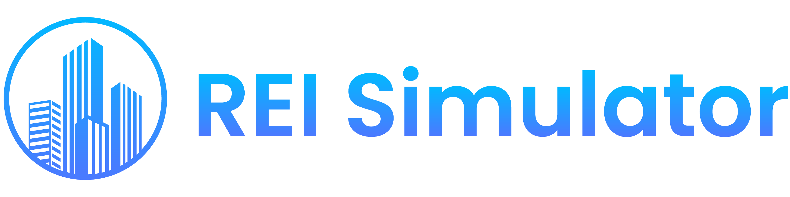
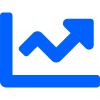

  

  
  
  

      
            Hello there
            
      

----

### 👨‍💻 About Me

Full Stack Developer from AK, where the natural landscapes inspire innovation. Passionate about real estate 🏠, robotics 🤖, and all things STEM 🔬. A sci-fi enthusiast, always looking beyond the horizon. When I'm not coding or tinkering, you'll find me outdoors, soaking in the wonders of nature. Here to collaborate, innovate, and bring imaginative ideas to life. Let's build the future together! 🚀

----

### 🏠 [**Current Project**](https://www.reisimulator.com)

I'm at the helm of creating a groundbreaking real estate investing software that aims to streamline, optimize, and redefine the way investors analyze, compare, and manage properties. From crunching numbers for ROI calculations to offering predictive market analytics, I'm pushing the envelope in making real estate investing more accessible and data-driven.

    <h5> Real Estate Investing Simulator</h5>
    
This cutting-edge simulator empowers investors to test a wide variety of investment scenarios in a risk-free environment. Whether you're new to real estate or a seasoned expert, experience the confidence of informed decision-making without the stakes of real-world investing.

    <!-- Chart icon for Portfolio Management -->
    <h5> Portfolio Management & Projection Software</h5>
    
Bring your real estate investments into sharp focus. Our portfolio management tool integrates seamlessly with the simulator, granting investors the ability to make strategic decisions around their actual investments. Harness the power of real-time projections and dynamic analytics to navigate your investment journey with precision.

    <!-- Search icon for Browser Extension -->
    <h5> Investment Potential Analyzer - Browser Extension</h5>
    
Stay ahead of the curve with our browser extension designed for on-the-fly analysis. Scan properties directly from your browser, instantly gauging their investment potential. Streamline your property search and ensure every decision is backed by data.

<!-- REI Simulator Socials -->

    <!-- Facebook -->
    
    <!-- Instagram -->
    
    <!-- LinkedIn -->
    
    <!-- Twitter -->
    
    <!-- Youtube -->
    

----

### 💡 Projects

- **Pulse**: An engaging application that captures and shares the pulse of society, reflecting popular opinion on various issues. Check the iOS App out [here](https://apps.apple.com/us/app/social-pulse/id1659532299)

----

### 🛠️ Languages and Tools

  
  
  
  
  
  
  
  
  
  
  
  
  
  
  
  
  

